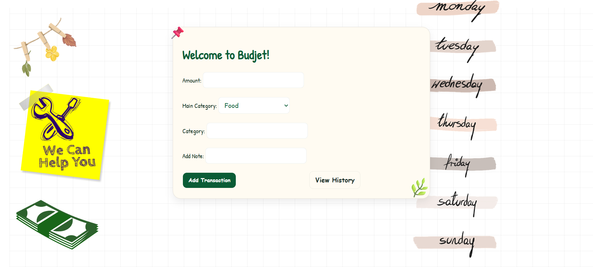
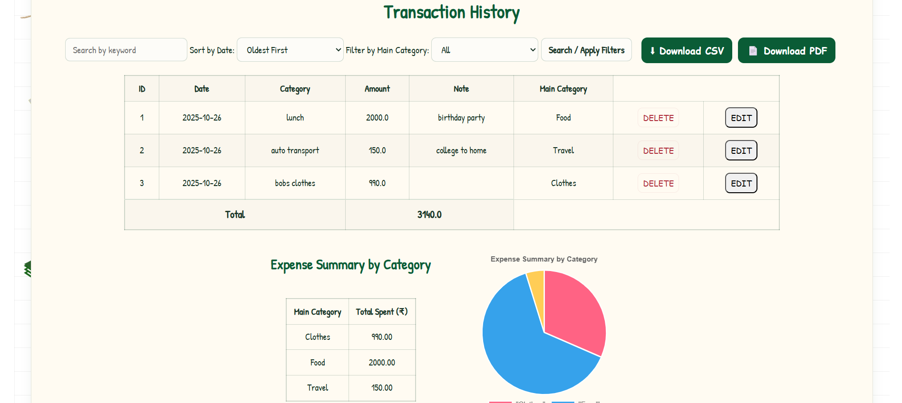
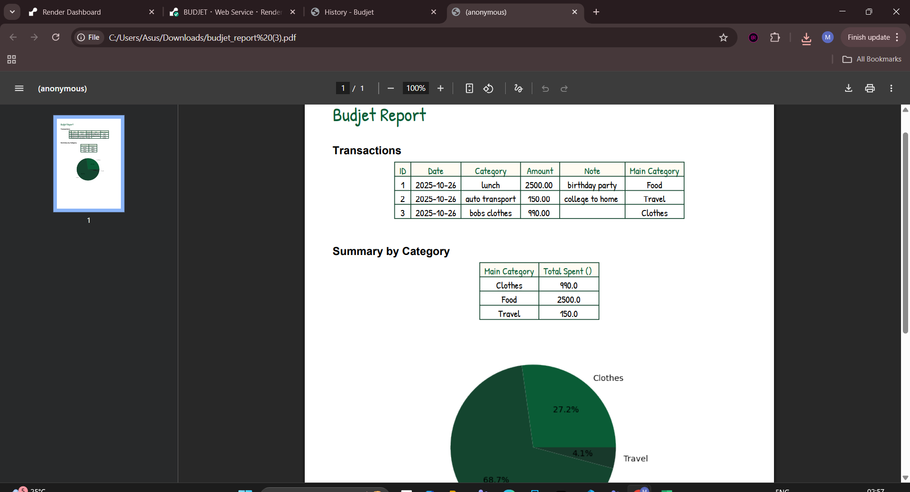

# 💰 BudJet – Personal Finance Tracker

> A smart and simple web application to **track expenses, manage budgets, and visualize spending** — built with Flask and deployed on Render.

🔗 **Live Demo:** [https://budjet-w1zb.onrender.com](https://budjet-w1zb.onrender.com)

---

## 🌟 Overview

**BudJet** helps users maintain financial discipline by offering an intuitive interface to:
- Add and categorize transactions
- View expense summaries
- Download detailed reports
- Visualize spending patterns with interactive charts

Designed with an **aesthetic, sticker-themed UI**, BudJet combines functionality and visual appeal for a delightful budgeting experience.

---

## 🖼️ Preview

| Dashboard | Add Transaction | Pdf View |
|------------|----------------|-------------|
|  |  |  |


---

## ⚙️ Features

✅ Add, edit, and delete transactions easily  
✅ Categorize expenses (e.g., Food, Travel, Bills, etc.)  
✅ View interactive visualizations using **Chart.js**  
✅ Download transactions as a **PDF summary**  
✅ Responsive and lightweight UI with custom sticker elements  
✅ Persistent storage with **SQLite**  
✅ Fully deployed and accessible online  

---

## 🧠 Tech Stack

| Layer | Technologies |
|-------|---------------|
| **Backend** | Python (Flask) |
| **Frontend** | HTML, CSS, JavaScript, Chart.js |
| **Database** | SQLite |
| **Deployment** | Render |
| **Design** | Custom UI + Stickers + Responsive Layout |

---

## 🚀 Setup & Installation (For Local Development)

```bash
# 1️⃣ Clone the repository
git clone https://github.com/yourusername/budjet.git
cd budjet

# 2️⃣ Create a virtual environment
python -m venv venv
source venv/bin/activate   # For macOS/Linux
venv\Scripts\activate      # For Windows

# 3️⃣ Install dependencies
pip install -r requirements.txt

# 4️⃣ Run the application
python app.py

# 5️⃣ Visit
http://127.0.0.1:5000/
```
## FOLDER STRUCTURE 

```plaintext
budjet/
│
├── app.py
├── requirements.txt
├── static/
│   ├── css/
│   ├── js/
│   └── images/
├── templates/
│   ├── index.html
│   ├── add.html
│   └── base.html
└── database/
    └── transactions.db
```

## 📄 Deployment

The app is deployed on Render using:
- Build Command: pip install -r requirements.txt
- Start Command: gunicorn app:app
- Environment: Python 3.11
- Region: US (Oregon)
- Auto-deploy is enabled for every push to the main branch.

## 🧑‍💻 Author

Lakshmi Tulasi
🎓 AI & Web Development Enthusiast
📬 LinkedIn
 • GitHub

💡 Future Enhancements

- User authentication and personalized dashboards
- Cloud database integration
- Expense prediction using AI
- Monthly budgeting goals and alerts

🏷️ License
This project is licensed under the MIT License — free to use and modify.

## “Small savings lead to big changes — start with BudJet today!”
